# Sentiment Analysis (Final Report)
**Georgia Institute of Technology CS4641 Team 7**

Adil Farooq  
Aditya Singh  
Jiaying Zhu  
Ngoc Khai Huyen Nguyen  
Yongyu Qiang  

## Introduction/Background
Sentiment analysis is a NLP field that identifies, extracts, and categorizes subjective information from text. Among others, naive Bayes, K-nearest neighbors, decision trees, support vector machines, and neural networks are popular ML algorithms in literature used for textual analysis [1]. Specifically, Maks and Vossen showed that lexicon models that identify parts of speech and their relationships are effective for sentiment analysis [2].
## Problem Definition
With exponential growth in textual data generated daily, there is a pressing need for sentiment analysis to efficiently process this vast amount of information. Automated sentiment analysis enables agencies to identify emerging trends and gain insights into how information is perceived by the public. The main challenge lies in developing accurate and robust models that can effectively understand and interpret nuanced opinions expressed in text data.
## Methods
### Data Preprocessing Methods
For preprocessing, we’ll transform the dataset into Bag-of-Words representations using CountVectorizer from Sklearn. Sentences will be simplified into individual word tokens and converted to lowercase to help with analysis. Using NLTK, stop words [3] like common articles, prepositions, etc. that do not contribute to meaning will be removed. Verb conjugations or suffixes will be removed with the PorterStemmer algorithm. This reduces redundant complexity, allowing variations like "run", “Run”, “run the”, and "running" to be treated similarly. Additionally, we’ll use principal component analysis to decrease the number of unique words and reduce dimensionality.

The lexicon model approach in [2] is a viable alternative for preprocessing. As Uysal and Gunal [3] discovered, testing various combinations of the above options could also significantly impact text classification algorithm performance.
The preprocessing was implemented using NLTK as it is a comprehensive Python library for natural language processing equipped with tools for parsing, feature extraction, and sentiment analysis.
We first tokenized our text data and converted it to a *bag of words* representation, which keeps track of the
unique words and word counts in the text. As a simplification, we only kept track of the presence or absence of
words and not their count, since we felt that the repetition of words in a headline was unimportant to deciding
its sentiment.

From there we made some common modifications to the bag of words data, such as removing *stop words* (common words
that are present in almost every text such as "there" or "are") and *stemming* (reducing words to a common root form,
e.g. converting "promoters" and "promote" to "promot"). This is in an attempt to make our models focus on the
meaning of words and avoid them getting stuck on technical grammar points like verb conjugations. Finally, we
performed *principal component analysis (PCA)* to reduce the dimensionality of our data since the bag of words
representation is typically associated with very high-dimensional data (there are typically many unique words
in an collective corpus of several texts). Running PCA and keeping 99.9% of the variance in the data,
we were able to reduce the the number of features in our dataset from approximately 7350 to 5850, about a
20% reduction. We further created numerous smallester datasets with the 100-4000 features that captured the most variance per PCA. These sets were the ones primarily used for training and testing models, though the 99.9% set and the full dataset came in useful several times.

### Algorithms/Models
For supervised machine learning algorithms, we used Naive Bayes, a relatively fast yet effective classifier [4] as a baseline for comparison. We also used Support Vector Machines, as they remain effective even with high-dimensional data [5], which will help with the Bag-of-Words representation. Additionally, Convolutional Neural Networks were used as they’re flexible and may capture more complex relationships that we might not have previously considered. For unsupervised learning, k-means was tested as a trial run to see if naively clustering based on distances will reveal any meaningful information regarding various sentiments.

The K-means clustering algorithm is performing poorly on our sentiment analysis task, as evidenced by extremely low silhouette scores (ranging from 0.004 to 0.017) and the low accuracy (0.33, practically random). The silhouette scores, being close to zero, indicate that the samples are not well-matched to their own clusters and are very close to the decision boundary between clusters. This suggests that the K-means algorithm is struggling to find meaningful separations in the data. The fact that all predicted sentiments are "Neutral" while true sentiments vary indicates that the model is not capturing the sentiment variations in the data at all. We also performed GMM clustering on the dataset (100 to 4000 features, full dataset), and it gave very similar results.

## Potential Results and Discussion
In sentiment analysis/classification, we typically use traditional binary classification metrics such as F1-score, precision, recall, and accuracy [6], especially in multiclass scenarios where achieving a high macro-F1 score and accuracy is crucial [7].

Precision, recall, and F1 scores can provide per-class insights, while macro averaging prioritizes balanced consideration across classes [6].

Our goal is to achieve high accuracy and macro-F1 scores between 0.93 and 0.97 [7,8]. We’ll also use confusion matrices to visually display results and make our discussion of the results more intuitive and investigate whether the AUC metric provides any useful insights. [6] These metrics will guide adjustments to our methods and models, ensuring robust performance evaluation.
## Results and Discussion 
### Naive Bayes  
Visualization: 
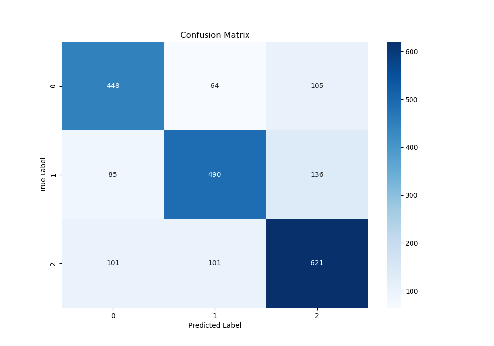  
Quantitative Metrics: 
The accuracy score was 72.5%.

Weighted average scores - Class 0 (neutral): 0.73, Class 1 (positive): 0.72, Class 2 (negative): 0.72 

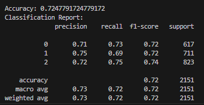  
Analysis: 
Naive Bayes performs well for sentiment analysis becuase of its efficiency in handling high-dimensional. Its assumption of feature independence holds reasonably well for text data, especially for bag-of-words representations. The model is great at handling categorical features, makes it particularly suitable for our sentiment analysis applications. The Multinomial model performs well in modeling word frequencies and can handle class imbalances common in sentiment datasets, which are crucial in determining sentiment. During testing, we found that having more features in our dataset increased overall accuracy, with the model having an accuracy of 53% for 100 features, 57% for 1000 features and 73% for an unreduced featureset. We also tested Bernoulli Naive Bayes model. We also tested the use of a BernoulliNB, but since the model only determines whether features are present, it performed poorly. MultinomialNB outperformed the bernoulli model as it takes into account the frequency of words and offers more complexity.

Next Steps: Feature engineering could be used to improve the accuracy of the model. We could use different text vectorization methods, for example TF-IDF and experiment with n-grams. Additionally, we can use GridSearchCV or RandomizedSearchCV to optimize the alpha smoothing parameter and experiment with different prior class settings.

### SVM
Visualization:  
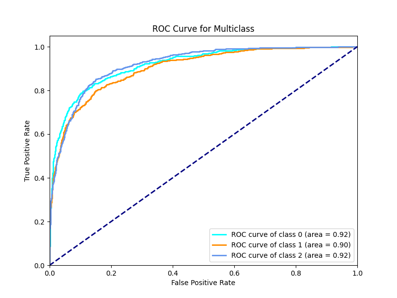  
The ROC curve for the multi-class classification problem illustrates the model's ability to distinguish between different sentiment classes. The AUC values for each class are:

Class 0 (neutral): 0.92
Class 1 (positive): 0.90
Class 2 (negative): 0.92
These values indicate a high level of discriminative power for the model.  
Quantitative Metrics:  
The accuracy score, which is a measure of the overall correctness of the model, was 0.775 (77.5%).  
[SVM Predictions](images/svm_3000.png)  
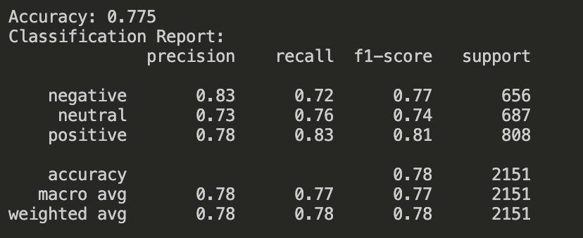   
Analysis:
The strengths and limitations of the different kernel types used in the SVM model were also analyzed. The SVM with a linear kernel, while simple and efficient, did not perform as well with non-linear data, leading to lower accuracy and AUC values. In contrast, the SVM with an RBF kernel had the best performance due to its ability to capture non-linear relationships in the data. The polynomial kernel also performed well but at a higher computational cost and with a greater risk of overfitting.
Overall, the analysis indicates that while the SVM model performs well in distinguishing sentiment classes, there is room for improvement. The model's ability to handle non-linear relationships is crucial, as evidenced by the superior performance of the RBF kernel. However, further tuning and enhancement can potentially boost the model's performance even further.  

Next Steps:
To improve the SVM model's performance, implementing ensemble methods like Random Forest or Gradient Boosting could provide better performance by combining the strengths of multiple models, thus improving robustness and reducing the risk of overfitting. In addition, using cross-validation ensures that the model's performance is consistent across different subsets of the data. This can help in identifying any potential overfitting and provide a more reliable estimate of the model's performance.

### Neural Network

Visualization:
The following is a confusion matrix for our dense neural network model:
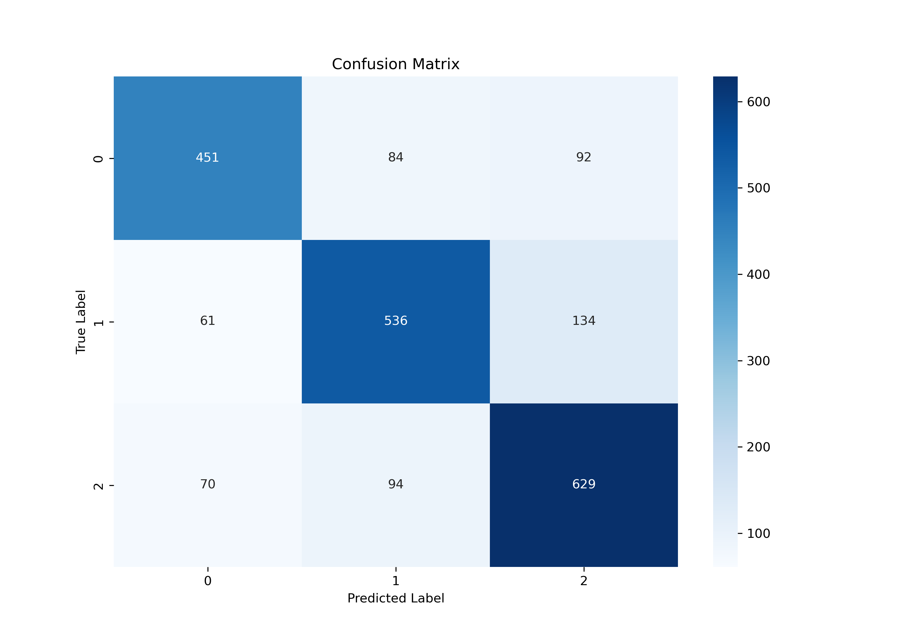
We also monitored accuracies for the training and validation sets for each epoch in the training process:
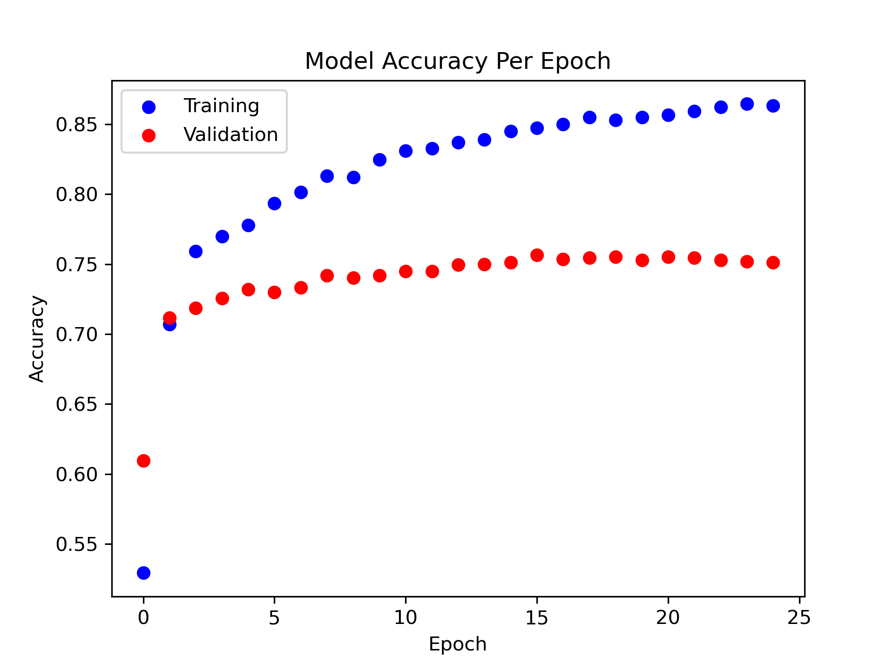

Quantitative Metrics:
The dense network model was able to achieve a testing accuracy of 0.751 (75.1%).
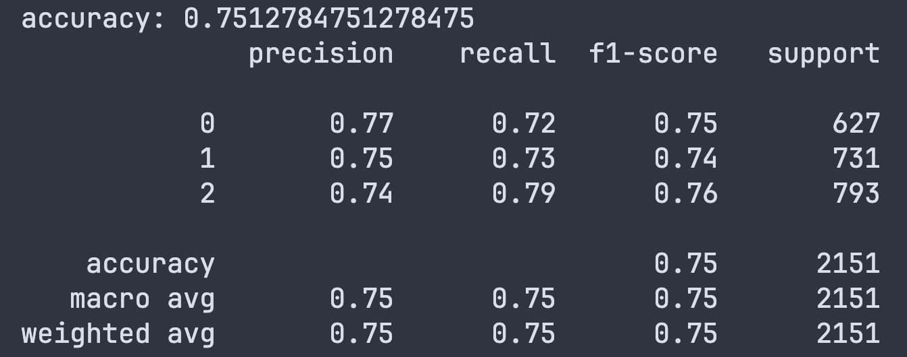

Analysis:
We first attempted a convolutional network which performed 1-D convolutions
on the bag-of-words representation. This attempt was highly unsuccessful, achieving accuracies of only around
0.40, which is only slightly better than a completely random model. We suspect that this failure is due to how
CNN's focus on small, local patterns in the data, which is ill-suited for our bag-of-words representation.
In fact, the bag-of-words representation removes all spatial relationships between words, which completely
goes against the strengths of a CNN. We then attempted a regular dense neural network, using dropout layers
and L2-regularization to prevent overfitting. Hyperparameters in the network were hand-tuned. This model
performed much better, achieving accuracies of around
0.75. We think that the dense network performed much better since it is able to consider all relationships between
words together, rather than focusing on spatial ones.

Next Steps:
One improvement to be made is to consider automating the selection of hyperparameters via cross-validation or
grid search. This allows us to systematically select hopefully better hyperparameters as compared to tuning
them manually. It can also avoid some potentially incorrect biases towards certain ranges of hyperparameters that
may be present when hand-tuning the model.

### Decision Tree
Visulization:  
Reduced Dataset (X_400):  
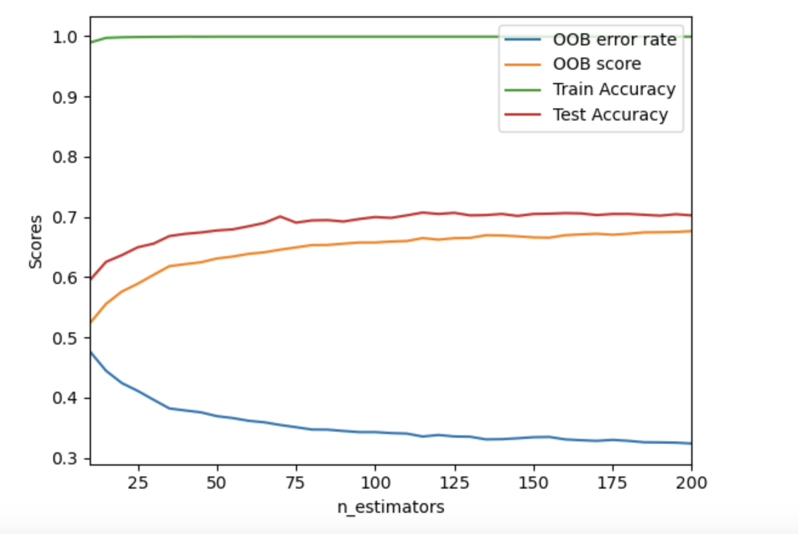  
Unreduced Dataset (X_full):  
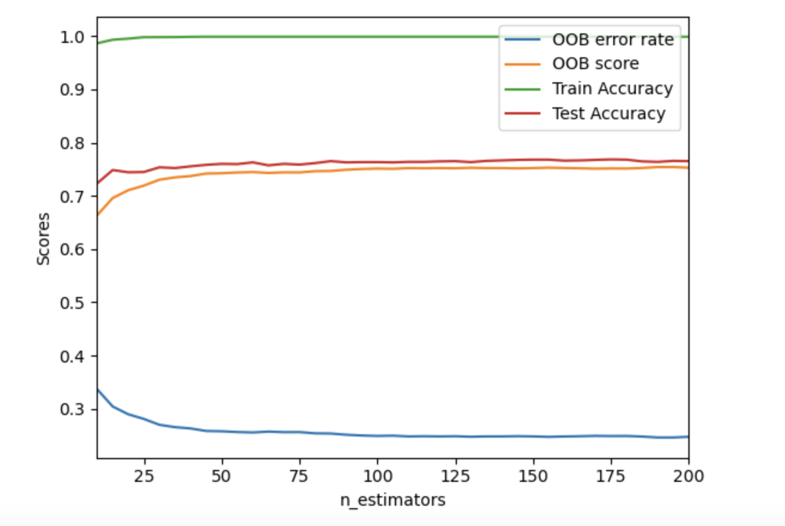
Quantitative Metrics:  
Reduced Dataset (X_400):
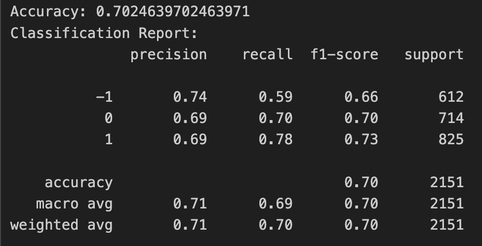  
Unreduced Dataset (X_full):  
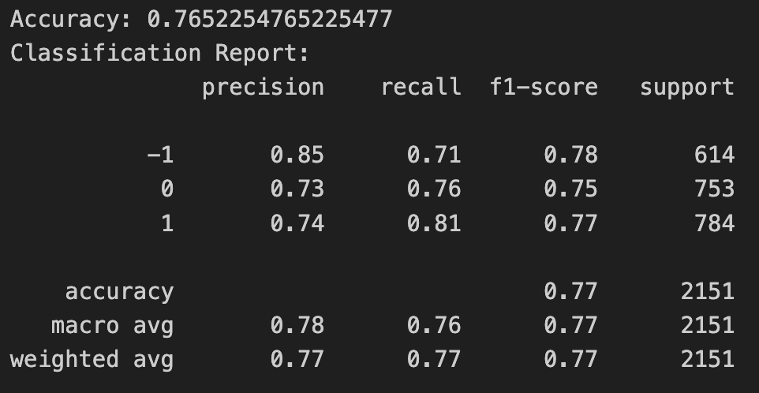  
Analysis: From the PCA reduced datasets, X_400 performs best with top accuracy of 0.71 (final accuracy of 0.70). It plateaued after ~100 trees in the forest, we ran it for 200 trees. Less than 400 features and more than 400 features (all the way up to 4000 features and 99% of variance) gave lower accuracy scores – as low as 0.60. But, the BEST results were 0.77 with the unreduced dataset X_full. In this case, the accuracy also plateaued around 0.76/0.77 as early as 50 trees of 200!  
The non-PCA reduced graph (X_full) outperformed all other datatsets including the X_400, X_4000 and X_99% sets, but the X_400 outperformed all other PCA reduced datasets (increases of up 11% between it and very reduce and very un-reduced datatsets). We posit that means PCA worked in general, but that the early features PCA eliminated (even from like ~6000 to ~5000 features, preserving 99% variance) were actually quite important! At least for decision trees!  

Next Steps: For future work, we would use the random forest feature selection method instead of PCA and see if it makes a difference for other models. We would also try gradient boosted decision trees to see if we get a better result.

### Gradient Boosted Decision Trees (GBDTs)
Initial testing of Gradient Boosted Decision Trees showed very similar results to random forests, even when experimenting with the hyper parameters. The same trends where observed in relation to PCA'd data and the unreduced dataset performing better. 

Our current hypothesis is that GBDTs performed about the same as random forests because GBDTs attempt to make each subsequent decision tree make up for the weaknesses of the prior trees. With random forests exhibiting very similar behavior to GBDTs, we can only conclude that actively attempting to compensate for the weaknesses of past trees in new trees yields results no better than randomly generating trees. It seems, perhaps, retrospectively intuitive that the problem of sentiment analysis in headlines is a set of many simple problems (easily dealt with by a bunch of random trees) rather than a few complex or niche or counterintuitive problems (that would require special emphasis on certain features and samples that GBDTs provide). Thus, the behaviour of random forests with their randomly independent trees is not very different from GBDTs attempting to sequentially increase accuracy with each new tree, when it comes to sentiment analysis of headlines. 

The significantly increased training time makes GBDTs seem a far worse option than random forests for this problem. It is worth noting that GBDTs did slightly better on the reduced dataset, but only by 1-2% and with many more trees and a much longer training time. 

## K-means & GMM
Results: 
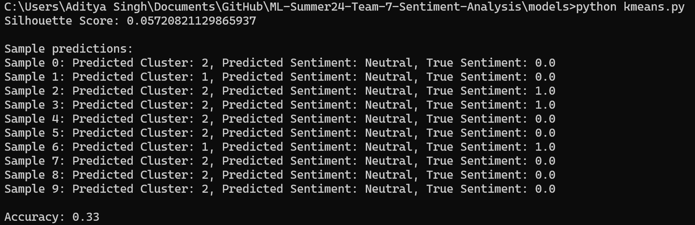  
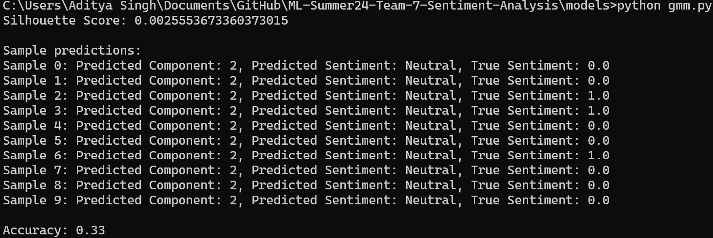  
Analysis:
As we can see, with three possible clusters, and accuracy of 33% is essentially random. The model was classifying all of the test data as neutral, and that, combined with the low silhouette scores, told us that unsupervised clustering algorithms were unable to find any meaningful differences between the different headlines. This result was within expectations, and we were only trying these models to confirm out suspicions.

## Comparison
Accuracy:  
Naive Bayes: 72.5%  
SVM: 77.5%  
Neural Network: 75.1%  
Random Forest: 77%  
GBDTs: 77%  
K-means & GMM: 33%  

SVM performed the best overall, with the highest accuracy and good area under the curve scores (0.90-0.92). Random Forest tied with SVM for best performance on the unreduced dataset. GBDTs tied with Random Forest and SVM as well, but the unnecessarily increased training times for almost the exact same results as Random Forest make it not a great option. Neural Network and Naive Bayes had slightly lower accuracies. While Naive Bayes has the lowest accuracy, it is also the simplest model, giving it an edge in time and space complexity. SVM with RBF kernel and Neural Network are more complex and are capable of capturing non-linear relationships. Neural Network is not the best choice as its accuracy is not high enough given the tradeoff of having a large computational volume. Random Forest takes advantage of having many decision trees, which gives it a good balance of complexity and interpretability. Random Forests trained exceptionally fast in ~5 minutes for the full dataset and 1:15 min for the reduced X_400 dataset.

In terms of feature handling, Naive Bayes performed better with more features, showing improvement from 53% (100 features) to 73% (unreduced feature set). SVM, particularly with RBF kernel, handled non-linear relationships well. Neural Network struggled with CNN approach on bag-of-words, but performed better with dense layers. Decision Tree performed best with the unreduced dataset, suggesting it benefited from all available features and that PCA possibly removed vital features early on, possibly impacting many other models.

In summary, while SVM and Random Forest showed the highest accuracies, each model has its strengths and areas for potential improvement. The choice between them will depend on whether interpretability or computational resources is a priority.

## Gantt Chart
[Team 7-Gantt Chart](https://gtvault-my.sharepoint.com/:x:/g/personal/jzhu491_gatech_edu/ETq22_plETFBv1rCJ58wni0B9rK3IZXenrD21P_5AH10gw?e=c3O0JP)

## Contributions
| Name                         | Final Report Contributions |
| -----------                   | ----------- |
| Adil Farooq                   | Model Implementation & Coding      |
| Aditya Singh                  | Model Implementation & Coding      |
| (Jenny) Jiaying Zhu           | Model Implementation & Coding      |
| (Khai) Ngoc Khai Huyen Nguyen | Model Implementation & Coding      |
| (Frank) Yongyu Qiang          | Model Implementation & Coding      |
## References
[1] Michał Mirończuk, Highlights, “A recent overview of the state-of-the-art elements of text classification,” Expert Systems with Applications, https://www.sciencedirect.com/science/article/pii/S095741741830215X (accessed Jun. 14, 2024).

[2] Maks et al., “A lexicon model for deep sentiment analysis and opinion mining applications,” Decision Support Systems, https://www.sciencedirect.com/science/article/pii/S0167923612001364 (accessed Jun. 14, 2024).

[3] Alper Kursat Uysal et al., “The impact of preprocessing on text classification,” Information Processing & Management, https://www.sciencedirect.com/science/article/pii/S0306457313000964 (accessed Jun. 14, 2024).

[4] “1.9. naive Bayes,” scikit, https://scikit-learn.org/stable/modules/naive_bayes.html (accessed Jun. 14, 2024).

[5] “1.4. Support Vector Machines,” scikit, https://scikit-learn.org/stable/modules/svm.html (accessed Jun. 14, 2024).

[6]“3.3. Metrics and scoring: quantifying the quality of predictions — scikit-learn 0.22.1 documentation,” scikit-learn.org. https://scikit-learn.org/stable/modules/model_evaluation.html

[7]“Which metrics are used to evaluate a multiclass classification model’s performance?,” www.pi.exchange. https://www.pi.exchange/knowledgehub/metrics-to-consider-when-evaluating-a-multiclass-classification-models-performance (accessed Jun. 15, 2024).

[8]“Accuracy, precision, and recall in multi-class classification,” www.evidentlyai.com. https://www.evidentlyai.com/classification-metrics/multi-class-metrics
