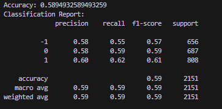

# Sentiment Analysis
**Georgia Institute of Technology CS4641 Team 7**

Adil Farooq  
Aditya Singh  
Jiaying Zhu  
Ngoc Khai Huyen Nguyen  
Yongyu Qiang  

## Midterm Report

### Introduction/Background
Sentiment analysis is a NLP field that identifies, extracts, and categorizes subjective information from text. Among others, naive Bayes, K-nearest neighbors, decision trees, support vector machines, and neural networks are popular ML algorithms in literature used for textual analysis [1]. Specifically, Maks and Vossen showed that lexicon models that identify parts of speech and their relationships are effective for sentiment analysis [2].
### Problem Definition
With exponential growth in textual data generated daily, there is a pressing need for sentiment analysis to efficiently process this vast amount of information. Automated sentiment analysis enables agencies to identify emerging trends and gain insights into how information is perceived by the public. The main challenge lies in developing accurate and robust models that can effectively understand and interpret nuanced opinions expressed in text data.

### Change in Dataset
In the project proposal, we planned on using AG's news topic dataset. However, this dataset was more geared towards topic classification rather than sentiment analysis, so we decided find another dataset that was more in line with our project topic. We ended up using the SentFin news headline dataset instead as it was already labeled with the specific financial entities and the sentiments associated with it. 

The following are graphs of the distribution of sentiments and title word counts in the dataset (after preprocessing):

### Methods
#### Data Preprocessing
For preprocessing, we’ll transform the dataset into Bag-of-Words representations using CountVectorizer from Sklearn. Sentences will be simplified into individual word tokens and converted to lowercase to help with analysis. Using NLTK, stop words [3] like common articles, prepositions, etc. that do not contribute to meaning will be removed. Verb conjugations or suffixes will be removed with the PorterStemmer algorithm. This reduces redundant complexity, allowing variations like "run", “Run”, “run the”, and "running" to be treated similarly. Additionally, we’ll use principal component analysis to decrease the number of unique words and reduce dimensionality.

The lexicon model approach in [2] is a viable alternative for preprocessing. As Uysal and Gunal [3] discovered, testing various combinations of the above options could also significantly impact text classification algorithm performance.
The preprocessing was implemented using NLTK as it is a comprehensive Python library for natural language processing equipped with tools for parsing, feature extraction, and sentiment analysis.
We first tokenized our text data and converted it to a *bag of words* representation, which keeps track of the
unique words and word counts in the text. As a simplification, we only kept track of the presence or absence of
words and not their count, since we felt that the repetition of words in a headline was unimportant to deciding
its sentiment.

From there we made some common modifications to the bag of words data, such as removing *stop words* (common words
that are present in almost every text such as "there" or "are") and *stemming* (reducing words to a common root form,
e.g. converting "promoters" and "promote" to "promot"). This is in an attempt to make our models focus on the
meaning of words and avoid them getting stuck on technical grammar points like verb conjugations. Finally, we
performed *principal component analysis (PCA)* to reduce the dimensionality of our data since the bag of words
representation is typically associated with very high-dimensional data (there are typically many unique words
in an collective corpus of several texts). Running PCA and keeping 99.9% of the variance in the data,
we were able to reduce the the number of features in our dataset from approximately 7350 to 5850, about a
20% reduction.

The NLTK Naive Bayes model is particularly well-suited for sentiment analysis of news headlines due to its simplicity and efficiency with short texts. The model performs well with limited training data and handles rare words effectively. Additionally, iy provides interpretable results, making it an excellent choice for quick analysis of large volumes of headlines. While more advanced techniques might outperform it in complex scenarios, NLTK's Naive Bayes model remains a strong baseline for sentiment analysis in this context.

#### Machine Learning Algorithms
For supervised machine learning algorithms, we plan to use naive Bayes, a relatively fast yet effective classifier [4] as a baseline for comparison. We’ll also use Support Vector Machines, as they remain effective even with high-dimensional data [5], which will help with the Bag-of-Words representation. Additionally, Convolutional Neural Networks can be used as they’re flexible and may capture more complex relationships that we might not have previously considered. For unsupervised learning, k-means can be used as a trial run to see if naively clustering based on distances will reveal any meaningful information regarding various sentiments.

The K-means clustering algorithm is performing poorly on our sentiment analysis task, as evidenced by extremely low silhouette scores (ranging from 0.004 to 0.017) and the low accuracy (0.33, practically random). The silhouette scores, being close to zero, indicate that the samples are not well-matched to their own clusters and are very close to the decision boundary between clusters. This suggests that the K-means algorithm is struggling to find meaningful separations in the data. The fact that all predicted sentiments are "Neutral" while true sentiments vary indicates that the model is not capturing the sentiment variations in the data at all.
We ar planning on performing GMM and DBSCAN to further the Kmeans model.

### Potential Results and Discussion
In sentiment analysis/classification, we typically use traditional binary classification metrics such as F1-score, precision, recall, and accuracy [6], especially in multiclass scenarios where achieving a high macro-F1 score and accuracy is crucial [7].

Precision, recall, and F1 scores can provide per-class insights, while macro averaging prioritizes balanced consideration across classes [6]. 

Our goal is to achieve high accuracy and macro-F1 scores between 0.93 and 0.97 [7,8]. We’ll also use confusion matrices to visually display results and make our discussion of the results more intuitive and investigate whether the AUC metric provides any useful insights. [6] These metrics will guide adjustments to our methods and models, ensuring robust performance evaluation.

### Results and Discussion
The performance of your Naive Bayes (BernoulliNB) model is as follows:  

Accuracy: The overall accuracy is 0.59, or 59%. This means the model correctly classified 59% of all instances.

Class-wise performance:

Class -1:
Precision: 0.58
Recall: 0.55
F1-score: 0.57
Support: 656 instances
Class 0:
Precision: 0.58
Recall: 0.59
F1-score: 0.59
Support: 687 instances
Class 1:
Precision: 0.60
Recall: 0.62
F1-score: 0.61
Support: 808 instances

Macro average:
Precision: 0.59
Recall: 0.59
F1-score: 0.59
Weighted average:
Precision: 0.59
Recall: 0.59
F1-score: 0.59

Analysis:
The dataset seems relatively balanced, with class 1 having slightly more instances than the others. The model's performance is consistent across classes, with F1-scores ranging from 0.57 to 0.61. This suggests the model isn't biased towards any particular class. With an accuracy of 59%, the model performs better than random guessing (which would be 33% for a 3-class problem), but there's significant room for improvement.

Why the model might have performed this way:

BernoulliNB works with binary features. SInce the features are not naturally binary, some information might be lost in the conversion process. Naive Bayes also assumes feature independence, which might not hold true for the data. Since headlines are short, the model might not have enough informative features to make highly accurate predictions and there could be inconsistencies or noise in the dataset that make classification challenging.

Next steps:

Feature engineering: Create more informative features or transform existing ones to capture more relevant information.
Ensemble methods: Combine BernoulliNB with other models to potentially improve performance.
Error analysis: Examine misclassified instances to understand where the model is failing and why.
To further improve our analysis, we consider adding other visualizations to provide more insights into the model's performance across different classes.

### Gantt Chart
[Team 7-Gantt Chart](https://gtvault-my.sharepoint.com/:x:/g/personal/jzhu491_gatech_edu/ETq22_plETFBv1rCJ58wni0B9rK3IZXenrD21P_5AH10gw?e=c3O0JP)

### Contributions
| Name                         | Proposal Contributions |
| -----------                   | ----------- |
| Adil Farooq                   | Data Preprocessing, Model Implementation & Coding      |
| Aditya Singh                  | Dataset, Model Implementation & Coding      |
| (Jenny) Jiaying Zhu           | Dataset, Model Implementation & Coding      |
| (Khai) Ngoc Khai Huyen Nguyen | Dataset, Model Implementation & Coding      |
| (Frank) Yongyu Qiang          | Data Preprocessing, Model Implementation & Coding, Visualizations        |
### References
[1] Michał Mirończuk, Highlights, “A recent overview of the state-of-the-art elements of text classification,” Expert Systems with Applications, https://www.sciencedirect.com/science/article/pii/S095741741830215X (accessed Jun. 14, 2024).

[2] Maks et al., “A lexicon model for deep sentiment analysis and opinion mining applications,” Decision Support Systems, https://www.sciencedirect.com/science/article/pii/S0167923612001364 (accessed Jun. 14, 2024).

[3] Alper Kursat Uysal et al., “The impact of preprocessing on text classification,” Information Processing & Management, https://www.sciencedirect.com/science/article/pii/S0306457313000964 (accessed Jun. 14, 2024).

[4] “1.9. naive Bayes,” scikit, https://scikit-learn.org/stable/modules/naive_bayes.html (accessed Jun. 14, 2024).

[5] “1.4. Support Vector Machines,” scikit, https://scikit-learn.org/stable/modules/svm.html (accessed Jun. 14, 2024).

[6]“3.3. Metrics and scoring: quantifying the quality of predictions — scikit-learn 0.22.1 documentation,” scikit-learn.org. https://scikit-learn.org/stable/modules/model_evaluation.html

[7]“Which metrics are used to evaluate a multiclass classification model’s performance?,” www.pi.exchange. https://www.pi.exchange/knowledgehub/metrics-to-consider-when-evaluating-a-multiclass-classification-models-performance (accessed Jun. 15, 2024).

[8]“Accuracy, precision, and recall in multi-class classification,” www.evidentlyai.com. https://www.evidentlyai.com/classification-metrics/multi-class-metrics
